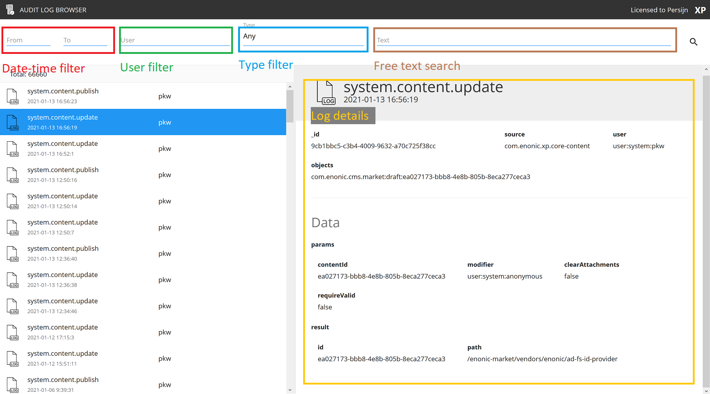

# Audit log browser
Show all audit log entries.

This app lets you browse and search for different audit log entries. 
It is required to have an enonic lisence to use the application. 

Easly find an entry and see all the details about the given entry. Possible to filter by audit log type, time or search for any id, or path in the full text search. 

Overview over all the different components in the audit-log application: 

**Objects:**
The objects fields is all affected tiems in the format: `repoid:contentid`. (a large publish entry can have hundres of elements in the objects field)

**Feel free to make feature requests!**

## Compatability

| version   | xp version | comment   |
|:---------:|:----------:|:---------:|
| 1.0.0     | 7.3.0      | Release   |
