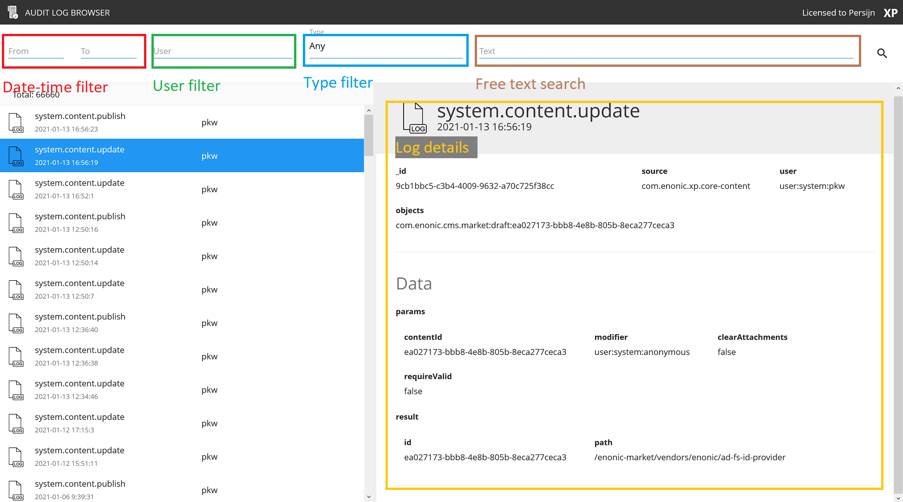

# Audit log browser

This app lets you browse and search for different audit log entries. 
It is required to have an Enonic license to use the application. 

Easily find an entry and see all the details about the given entry. Possible to filter by audit log type, time or search for any id or path in the full-text search. 

Overview over all the different components in the audit-log application: 

**Feel free to make feature requests!**
